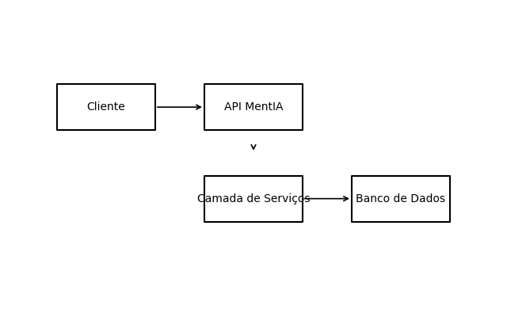

# Mentia API (C#)

Este repositório contém a implementação de um serviço web RESTful para o projeto **MentIA** desenvolvido em **C#** com **ASP.NET Core**. O objetivo é atender aos requisitos de boas práticas REST, versionamento de API, integração/persistência de dados usando **Entity Framework Core** e documentação via **Swagger**. 

## Integrantes do Grupo

- Integrante 1 — _Nome completo_
- Integrante 2 — _Nome completo_
- Integrante 3 — _Nome completo_

## Objetivo do Projeto

O MentIA é uma plataforma de inteligência artificial voltada para orientar pessoas em suas jornadas profissionais. Esta API expõe recursos para gerenciar usuários (e seus papéis) e sessões de mentoria, permitindo operações de **consultar**, **criar**, **atualizar** e **remover** com uso adequado dos verbos HTTP e códigos de status. A aplicação adota versionamento por URL (ex.: `/api/v1` e `/api/v2`) para evolução sem breaking changes.

### Principais Funcionalidades

- **Boas práticas REST**: uso correto de `GET`, `POST`, `PUT` e `DELETE`; códigos de retorno (`200 OK`, `201 Created`, `204 No Content`, `400 Bad Request`, `404 Not Found`, `409 Conflict` etc.);
- **Versionamento de API**: suporte a múltiplas versões através de roteamento (`/api/v{version}/`);
- **Persistência de Dados**: integração com banco de dados relacional usando **Entity Framework Core** e provider SQLite (pode ser substituído por SQL Server ou outro). O contexto (`MentiaDbContext`) e as entidades (`User`, `Role`, `Mentoria`) modelam o domínio;
- **Migrations**: suporte a migrations do EF Core para criação/atualização de esquema;
- **Documentação Swagger**: geração automática de documentação interativa para cada versão da API;
- **Fluxo Arquitetural**: descrição textual e diagrama ilustrando os principais componentes (cliente, API, serviço de negócio e banco de dados).

## Estrutura do Projeto

```
mentia_csharp/
├── MentiaApi.csproj       # arquivo de projeto com dependências
├── Program.cs             # configuração de serviços e pipeline
├── appsettings.json       # configuração de conexão e logging
├── Data/
│   └── MentiaDbContext.cs # contexto EF Core
├── Models/
│   ├── User.cs            # entidade de usuário
│   ├── Role.cs            # entidade de papel
│   └── Mentoria.cs        # entidade de mentoria
├── Controllers/
│   ├── UsersController.cs     # controle de usuários (v1/v2)
│   └── MentoriasController.cs # controle de mentorias (v1/v2)
├── docs/
│   └── architecture_diagram.png # diagrama de arquitetura gerado por script
└── README.md
```

## Configuração e Execução

1. **Pré‑requisitos**: .NET 7 SDK instalado. Opcionalmente, o CLI do EF Core (`dotnet tool install --global dotnet-ef`).
2. **Clonar o repositório** e acessar o diretório `mentia_csharp`.
3. **Restaurar pacotes**: `dotnet restore`.
4. **Gerar banco de dados** (opcional para SQLite, obrigatório se trocar para SQL Server, MySQL, etc.). Para criar a migration inicial e aplicar ao banco:
   ```bash
   dotnet ef migrations add InitialCreate
   dotnet ef database update
   ```
   Isso criará o arquivo `mentia.db` (ou a estrutura no SGBD configurado).
5. **Executar a API**: `dotnet run`. A aplicação iniciará em `https://localhost:5001` (ou porta configurada).
6. **Explorar a documentação Swagger**: acesse `https://localhost:5001/swagger` em ambiente de desenvolvimento para visualizar e testar as rotas de cada versão.

## Endpoints Principais (v1)

| Verbo | Rota                         | Descrição                                   |
|------|------------------------------|----------------------------------------------|
| GET  | `/api/v1/users`              | Lista todos os usuários                     |
| GET  | `/api/v1/users/{id}`         | Obtém um usuário específico                 |
| POST | `/api/v1/users`              | Cria um novo usuário                        |
| PUT  | `/api/v1/users/{id}`         | Atualiza um usuário existente               |
| DELETE| `/api/v1/users/{id}`        | Remove um usuário                           |
| GET  | `/api/v1/mentorias`          | Lista todas as mentorias                    |
| GET  | `/api/v1/mentorias/{id}`     | Obtém uma mentoria específica               |
| POST | `/api/v1/mentorias`          | Cria uma nova mentoria (mentor deve existir)|
| PUT  | `/api/v1/mentorias/{id}`     | Atualiza uma mentoria existente             |
| DELETE| `/api/v1/mentorias/{id}`    | Remove uma mentoria                         |

A versão 2 (`/api/v2/...`) atualmente expõe os mesmos recursos, mas permite evolução futura da API.

## Fluxo Arquitetural

O sistema segue uma arquitetura em camadas simples:

1. **Cliente** (front‑end ou consumidor) envia requisições HTTP para a API.
2. **API MentIA** (camada de apresentação/controladores) roteia as requisições para os serviços e realiza a validação de entrada.
3. **Camada de Serviços** (interna aos controladores) processa as regras de negócio e interage com a camada de dados.
4. **Camada de Dados** utiliza o **Entity Framework Core** para persistir e recuperar entidades no banco relacional.

O diagrama a seguir ilustra esses componentes e o fluxo principal de informações:



## Considerações Finais

Este projeto demonstra as práticas solicitadas no enunciado: definição de entidades, boas práticas REST, versionamento, integração com EF Core/Migrations, documentação Swagger e descrição de arquitetura. Ele pode ser expandido para incluir autenticação, autorização e regras de negócio específicas ao domínio MentIA conforme necessário.
